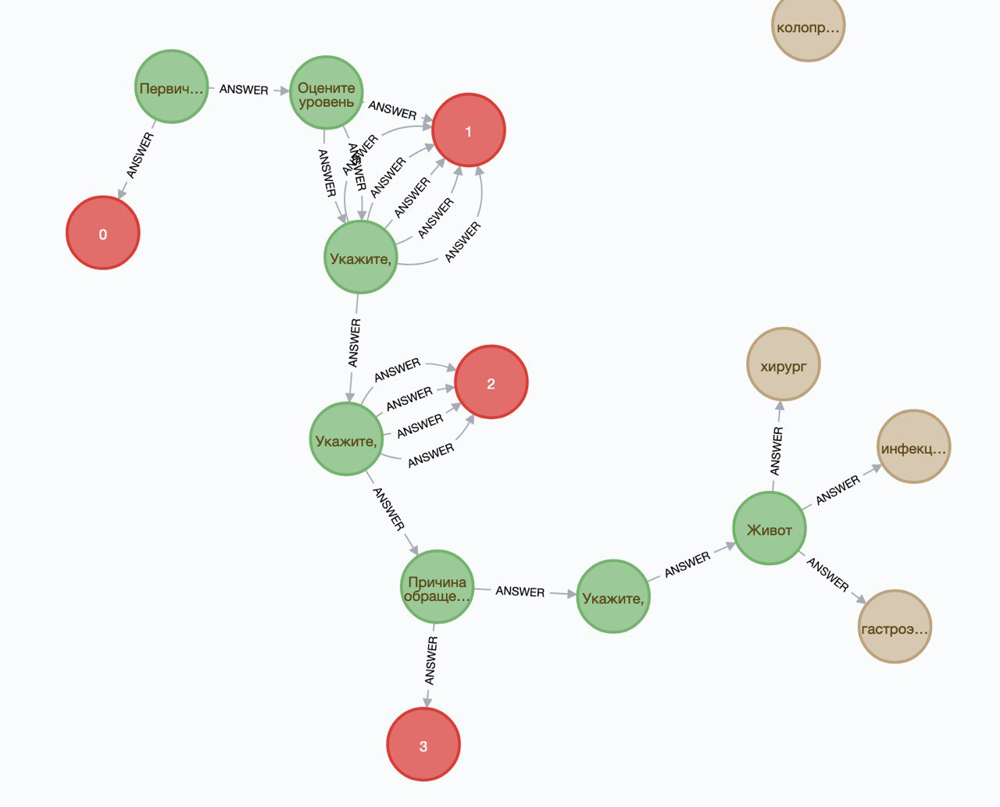

Описание решения
---

NOTE: директория `mobile-app` добавлен как git submodule из репозитория нашего мобильного разработчика.

### Реализованная функциональность

- Асинхронный REST API для инициализации сессии вопросов
- API, получающий вопросы из графовой базы данных на основе ответов пользователя



- Мобильное приложение, полностью интегрированное с сервисом в рамках опросника,
 и самостоятельно реализующее прочий функционал в качестве прототипа

### Особенности проекта:

- Продуманная архитектура данных, позволяющая гибко динамически изменять последовательность
  вопросов, списки ответов, их связи и пр.
- Опросник полностью генерируется на сервере, клиентское приложение только получает вопрос, возможные ответы и id виджета -
  обновление любых данных происходит динамически без релиза приложения
- Асинхронный подход позволяет добиться высокой производительности

### Технологии

Стек бэкенда:

- Python с фреймворком FastAPI для асинхронного сервера
- Neo4j для графа опросов 
- MongoDB для информации о клиниках
- Redis для пользовательских сессий
- nginx
- docker, docker-compose, linux, github

Стек мобильного приложения:
- Unity для прототипирования
- C#

### Демо

Swagger для API сервиса доступен [здесь](http://45.132.19.51/api).

Apk прототипа - [тут](TODO).

Запуск проекта
------------

Для запуска сервера подойдет любой компьютер с docker и docker-compose
(хотя с windows могут быть проблемы, тестировали на mac и linux).

```
git clone git@github.com:VoidDruid/secret-hack-2021.git
cd backend
docker-compose up --build -d
```

После этого swagger будет доступен на [http://localhost/api](http://localhost/api).

Остановить сервер можно с помощью `docker-compose down`

### Создание тестовых данных

Если хочется иметь тестовые данные, то необходимо зайти в главный контейнер и запустить скрипт генерации.
```
docker exec -it medical-api bash
make run-script
```
Затем выбрать `init` / `generate_questionnaire.py`.

### РАЗРАБОТЧИКИ

- **Бесчастнов Игорь** - backend. https://t.me/voiddruid, beschastnovigor@gmail.com
- **Шабанов Александр** - mobile. https://t.me/ALEKS_Developer
- **Когтева Анастасия** - дизайн. https://t.me/WassupNastya
- **Ковалев Василий** - product management. https://t.me/Minskij_Vasya
- **Бесчастнов Владимир** - консультант, доктор медицинских наук, https://t.me/Crossvvb, vvb748@mail.ru
